# MuseAI — Local AI Companions, Text Adventures, and Story-World Isekai

English | [简体中文](README.md)

> Create your AI characters and step into your own story world.
> MuseAI supports AI companion chat, character cards, world books, long-term memory, text adventures, story-world isekai, and local data storage.

MuseAI is a local-first AI app for immersive character interaction. You can create characters and worlds, keep talking with them over time, go on adventures together, and let each interaction build memory, relationship history, and emotional continuity.

It is not just a chatbot, and it is not only a writing tool. MuseAI is a local AI interaction world that keeps your characters, settings, memories, and relationships in one place.

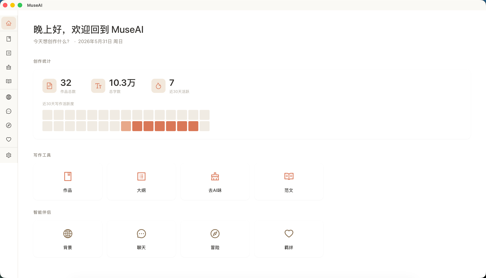

---

## Table of Contents

- [Who MuseAI Is For](#who-museai-is-for)
- [Core Experience](#core-experience)
- [Creative Support Tools](#creative-support-tools)
- [Quick Start](#quick-start)
- [Interface Preview](#interface-preview)
- [Local Data Storage](#local-data-storage)
- [FAQ](#faq)

---

## Who MuseAI Is For

- Users who want local AI companions, virtual characters, or long-running character chats
- Players who enjoy character cards, world books, AI roleplay, text adventures, and immersive story interaction
- Creators who want to enter a prepared story world and experience story-world isekai with branching choices
- Users who want to preserve character memories, relationship changes, key events, and bond timelines
- People who prefer keeping stories, settings, and sessions on their own computer while using their own API key

---

## Core Experience

### AI Companions and Character Chat

Create world books and character cards in Background, then choose a character in Companion Chat to start a one-on-one conversation. Characters respond based on their persona, speaking style, relationship with you, and past memories, so each chat can feel like part of an ongoing relationship rather than a disposable prompt.

- Customize names, personalities, relationships, boundaries, catchphrases, and backstories
- Bind characters to world books so they stay grounded in the same story world
- Archive memories to extract key events and update character cards
- Suitable for AI companions, virtual characters, OC chat, roleplay, and immersive companionship

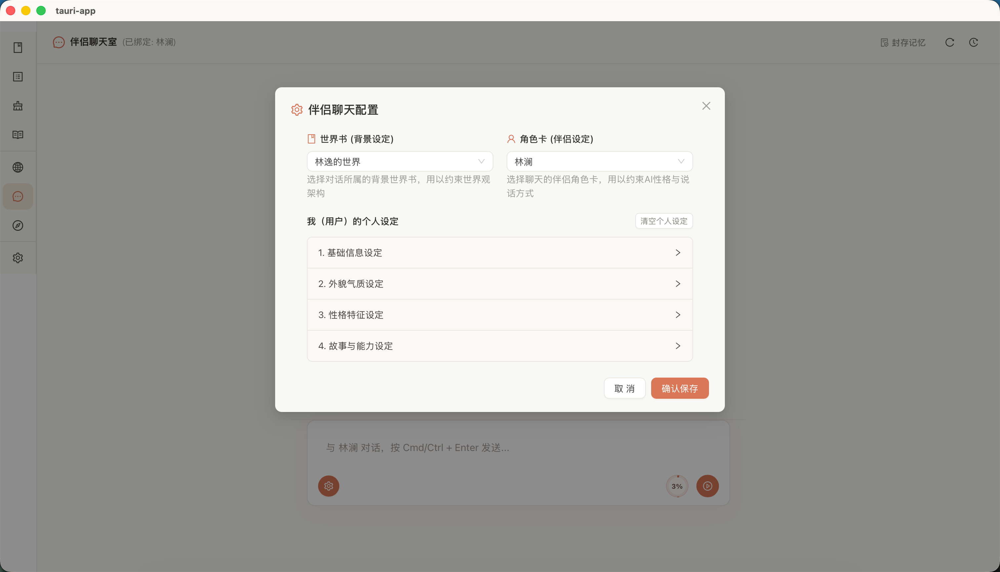

### Long-Term Memory and Bond Archive

After a chat or adventure, MuseAI can analyze what happened and write relationship changes, important events, and interaction patterns back into the character profile. The Bond page organizes these records by character, giving you a relationship history you can revisit.

- **Relationship overview**: view relationship type, interaction pattern, and boundaries
- **Bond timeline**: record key events in chronological order
- **Chat footprint**: show only the chats related to the selected character
- **Adventure footprint**: review the text adventures you shared with that character

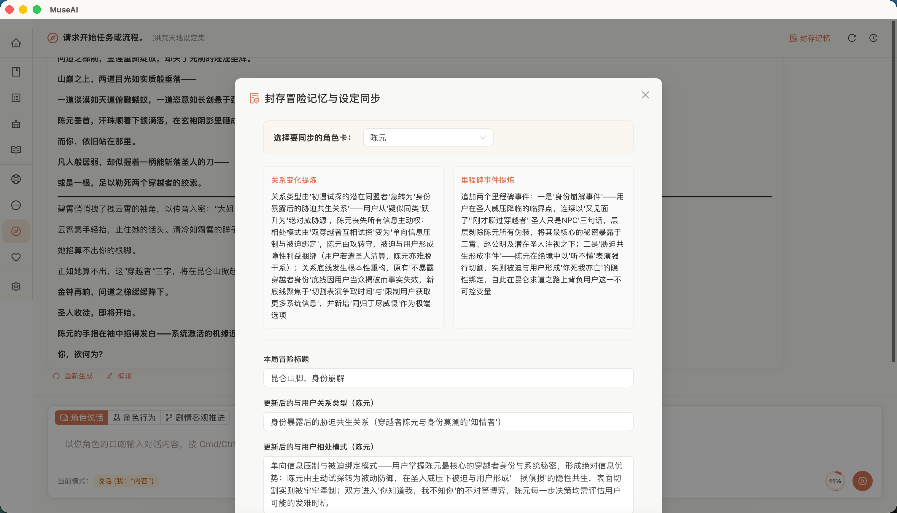

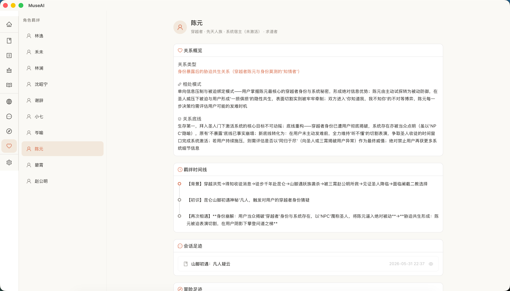

### AI Text Adventures and Roleplay

In Adventure, choose one world book and multiple character cards, then let MuseAI act as the story host or GM. You can move the story forward through speech, actions, or plot instructions while characters participate according to their own profiles.

- Bind one world book with multiple character cards
- Use speech, action, and plot input modes
- Let AI handle scene narration, character reactions, and story progression
- Archive adventure records as character memories and bond events

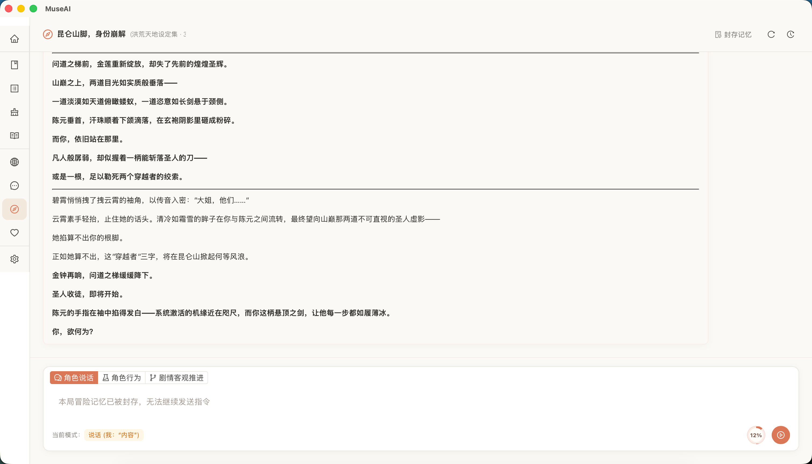

### Story-World Isekai

The Story mode turns outlines, world books, and character cards into a playable story world. You can choose an entry point and playable identity, enter the fictional world, and influence the plot through dialogue, action, and story choices.

- Assemble playable story materials from prepared outlines, world books, and character cards
- Generate entry points and playable identities with the entry director
- Track scenes, beats, state, and summary memory for longer-running plots
- Save story-world progress and continue later

Story-world isekai is for users who want to enter a fictional world, change the plot, and experience key events alongside characters.

### World Books and Character Cards

MuseAI supports manually created world books and character cards, and can also extract structured settings from novel text or outlines.

- **World books**: extract worldviews, era, geography, factions, rules, and core conflicts
- **Character cards**: identify names, personalities, relationships, speaking styles, key events, and their relationship with you
- **Reusable settings**: the same world books and character cards can power companion chat, text adventures, story-world isekai, and bond archives

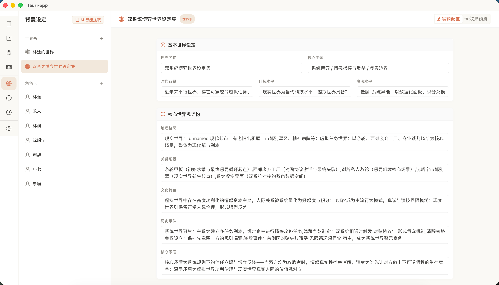

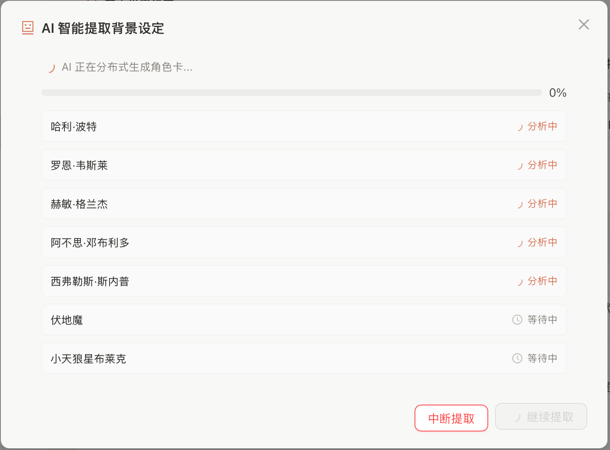

### Local Network Mobile Access

When the desktop app is running, MuseAI can be accessed from a phone browser on the same Wi-Fi network. You can continue companion chats, story adventures, and bond browsing on mobile without installing another app.

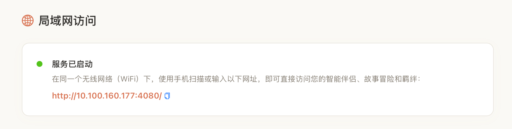

---

## Creative Support Tools

MuseAI focuses on AI companions, adventures, and story-world isekai, but it also includes creative tools that help you organize materials, refine settings, and prepare interactive story worlds.

### Works and Markdown Editing

Manage local writing files in a unified workspace with a built-in Markdown editor, live preview, syntax highlighting, and version history. MuseAI automatically creates backups before AI edits, so previous versions can be restored.

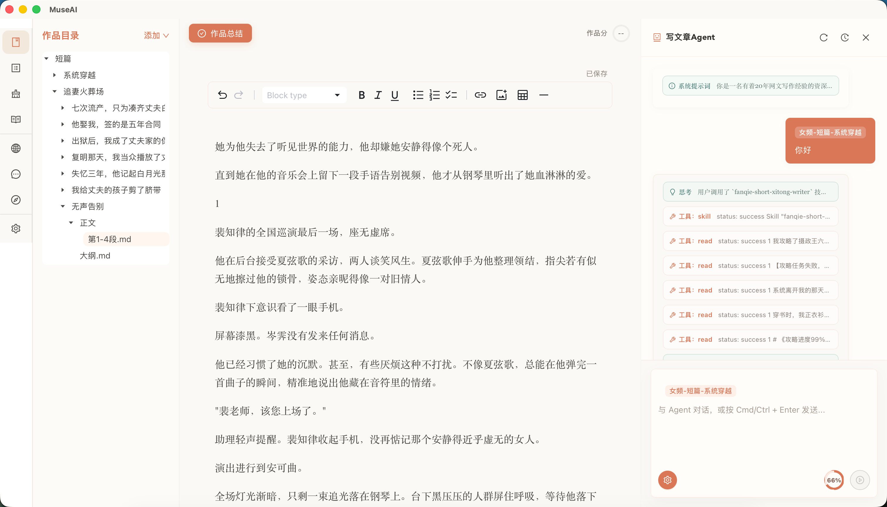

### Reference Library

Import reference articles you like. MuseAI can read them when giving writing or style suggestions, making its feedback better aligned with your preferences.

### Outline Evaluation, Generation, and Reverse Outlining

- **Outline evaluation**: upload an outline and receive scores plus detailed suggestions
- **Outline generation**: generate chapter structures from story requirements
- **Reverse outlining**: import a complete novel or long-form work and extract a structured outline
- **Long-form analysis**: split and analyze long works in parallel, making it easier to generate world books, character cards, and story-world materials

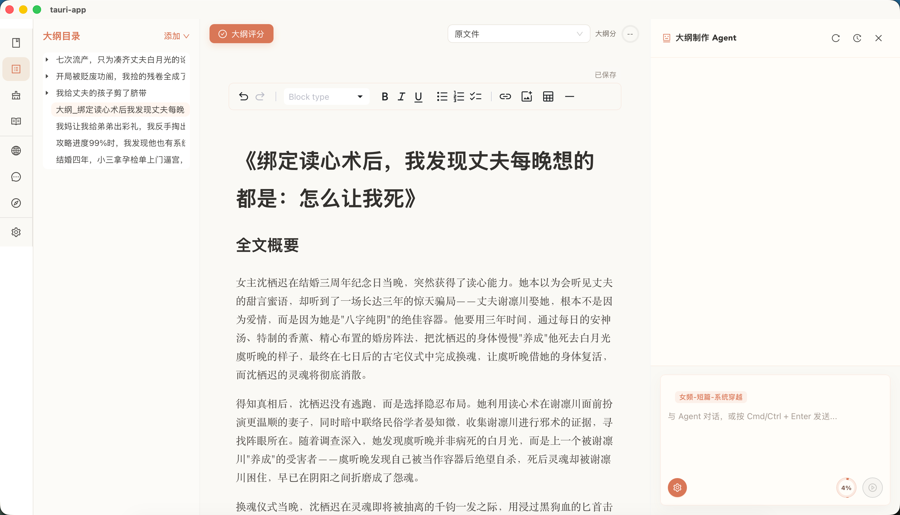

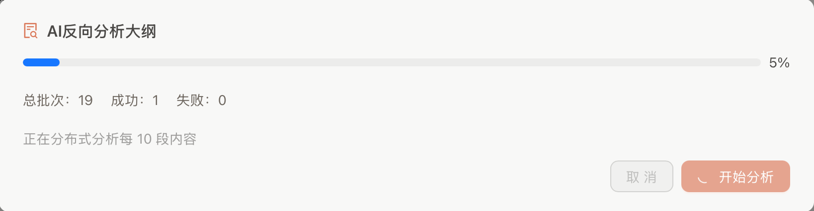

### AI-Generated Text Cleanup

If a piece of writing feels too machine-generated, MuseAI can first detect AI-like patterns and then generate a more natural revision. The original text is not overwritten.

- **Detection**: score AI-like phrasing and identify issues paragraph by paragraph
- **Cleanup**: rewrite based on the detection results for a more natural voice

---

## Quick Start

### 1. Download and Install

Go to the [Releases page](https://github.com/yejiming/MuseAI/releases) and download the latest installer (`.dmg` or `.exe`), then launch the app after installation.

**Windows users**: if antivirus software blocks the installer, temporarily disable tools such as 360, Tencent PC Manager, Huorong, or Windows Defender during installation, then re-enable them afterward.

If macOS says the app is damaged and cannot be opened, run this command in Terminal and try again:

```bash
xattr -dr com.apple.quarantine /Applications/MuseAI.app
```

### 2. Configure an AI Model

On first launch, open Settings and configure your model:

1. Enter an API key. MuseAI supports OpenAI, Anthropic, and OpenAI-compatible providers.
2. Enter the API base URL if you use a custom or proxy service.
3. Choose a model name, such as `deepseek-v4-flash` or `claude-sonnet-4-6`.
4. Click "Test Connection" to confirm the configuration.

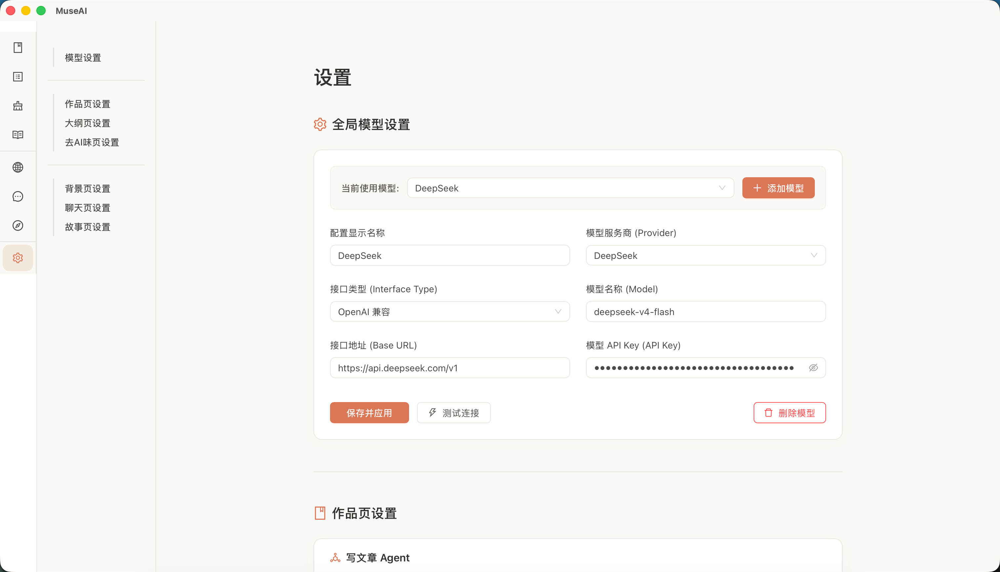

You can configure different models and parameters for companion chat, adventures, story-world isekai, AI-generated text cleanup, and outline workflows.

### 3. Start Using MuseAI

- **AI companion**: create a world book and character card in Background, then choose the character in Companion Chat
- **Text adventure**: choose a world book and character cards in Adventure, enter an opening scene, and start roleplaying
- **Story-world isekai**: assemble outlines, world books, and character cards in Story Materials, then enter Story mode
- **Bond archive**: after archiving chats or adventures, review relationship changes and key events in Bond
- **Creative support**: use Works, Outline, and AI-generated text cleanup to organize materials and improve text

---

## Interface Preview


*The home screen highlights AI companion, adventure, bond, story-world isekai, and creative tool entries.*


*Companion Chat: maintain an ongoing relationship with the characters you create.*


*Bond Archive: review relationship history, timelines, and shared experiences for each character.*


*Adventure: a text RPG mode where speech, action, and plot input move the story forward.*


*Background: organize world books, character cards, and reusable story materials.*

---

## Local Data Storage

MuseAI stores your data locally and does not upload it to external servers except when you explicitly call your configured AI provider.

User data is stored under `~/Documents/MuseAI/`:

| Data type | Location |
| --- | --- |
| Works | `~/Documents/MuseAI/articles/` |
| Reference library | `~/Documents/MuseAI/references/` |
| Outlines | `~/Documents/MuseAI/outline/` |
| Version history | `.versions/` folders beside the relevant files |
| Character cards / world books | `~/Documents/MuseAI/config/partner-store.json` |
| Companion sessions | `~/Documents/MuseAI/agent-sessions/partner-session-*.json` |
| Adventure sessions | `~/Documents/MuseAI/agent-sessions/story-session-*.json` |
| Writing agent sessions | `~/Documents/MuseAI/agent-sessions/session-*.json` |
| App settings | `~/Documents/MuseAI/config/settings-store.json` |
| UI state | `~/Documents/MuseAI/config/*.json` |

Back up `~/Documents/MuseAI/` regularly to avoid data loss.

---

## FAQ

**Q: How is MuseAI different from a normal AI chat app?**

A: Normal AI chat apps usually focus on one-off conversations. Characters, settings, and memories often end up scattered across different chats. MuseAI keeps world books, character cards, chat records, adventure records, and bond changes locally, so the same character can continue over time.

**Q: Is MuseAI an AI companion app or an AI writing tool?**

A: MuseAI is currently best described as a local AI companion, AI character chat, text adventure, and story-world isekai app. Works, outlines, reverse outlining, and AI-generated text cleanup are supporting tools for preparing story worlds and interactive materials.

**Q: Which AI providers are supported?**

A: MuseAI supports OpenAI, Anthropic Claude, and OpenAI-compatible providers such as DeepSeek, Kimi, Zhipu, Tongyi Qianwen, and proxy services. Enter the provider URL, API key, and model name in Settings.

**Q: What is an API key, and where do I get one?**

A: An API key is a credential issued by an AI provider. Register with the provider you want to use, then copy the key from its developer console or API settings page. MuseAI itself does not charge you; model usage costs are billed by your provider.

**Q: Why does the connection test fail?**

A: Common causes include:

- **Wrong API key**: check for extra spaces or missing characters.
- **Wrong API URL**: custom services often require a complete URL starting with `https://` and ending with `/v1`.
- **Network issues**: some providers may require a stable network route.
- **Insufficient balance**: some providers require account credit before API calls work.

**Q: Will my writing, character cards, and chat logs be uploaded to the cloud?**

A: Not automatically. Your works, reference library, outlines, character cards, world books, and session records are stored on your own computer under `~/Documents/MuseAI/`. Context is sent to your configured AI provider only when you send a message, analyze text, or generate content.

**Q: What is the difference between a world book and a character card?**

A:

- **World book** describes the broader story world, such as era, geography, rules, factions, and central conflicts. Multiple characters can share the same world book.
- **Character card** describes one person, including name, personality, speaking style, relationship with you, boundaries, and key events.

You do not need to fill everything in at once. Start with the most important details, then let memory archiving enrich the character over time.

**Q: What should I do if a character breaks immersion?**

A:

- Check whether the correct world book and character card are bound.
- If the conversation is very long, the model may lose earlier context. Start a new session or increase the chat agent context limit in Settings.
- You can also adjust the chat agent system prompt and temperature to make roleplay more stable or more expressive.

**Q: What is the difference between chat, adventure, and story-world isekai?**

A:

- **Companion Chat**: one-on-one immersive chat with one character card. Archived memories can update the character's relationship settings and key events.
- **Adventure**: roleplay-style storytelling with multiple character cards and one world book. The AI acts as the narrator or GM.
- **Story mode**: enter an assembled fictional world through an entry point and playable identity, then progress through scenes and beats while saving progress.

**Q: Why does reverse outlining fail?**

A: The most common reason is that the model output is truncated by token limits. Reverse outlining compresses a full work into a structured outline, and models may exceed the requested output length.

**Possible fixes**:

- In Settings, increase the max output token limit for reverse outline agents.
- Make the system prompt stricter and more specific about output length.

**Q: Why does world book or character card extraction fail?**

A: Usually one of two reasons:

- **Provider instability**: network or service issues can cause incomplete responses.
- **Invalid model format**: extraction requires strict JSON. If the model does not return valid JSON, parsing can fail.

Try again. For character extraction, manually listing character names can improve success rate.

**Q: Why does memory archiving fail?**

A: Memory archiving also requires strict JSON output. Provider instability or formatting mistakes can cause failures.

Try again first. If it fails repeatedly, set the memory archiving agent temperature to 0 in Settings to make output more stable.

**Q: Are mobile and desktop data synced?**

A: Mobile access uses your desktop app over the local network. Data is still stored on the computer, not in the cloud. As long as the computer stays available and the data is not deleted, mobile and desktop see the same records.

**Q: How does local network access work? Does my phone need the same Wi-Fi?**

A: Yes. Your phone and computer need to be on the same Wi-Fi or router. Start MuseAI on desktop, find the displayed address in Settings, then open it in your phone browser to use companion chat, adventure, and bond features.

**Q: Does AI-generated text cleanup modify the original file?**

A: No. Detection only analyzes the text and gives suggestions. If you run cleanup, MuseAI saves a new revised version while preserving the original.

**Q: How do I restore version history?**

A: In the file list, right-click the target file and choose version history. You can view and restore previous versions from there.

**Q: How do I back up my data?**

A: Copy the entire `~/Documents/MuseAI/` folder to a USB drive, external disk, or cloud drive. It contains your works, character cards, sessions, and settings. To migrate to another computer, copy it to the same location on the new machine.

**Q: Why are AI responses slow or interrupted?**

A:

- **Model speed**: providers and models vary a lot in response speed.
- **Network instability**: unstable connections can interrupt responses.
- **Token limits**: long conversations may hit max output or context limits.
- **Provider load**: some services may be slow or rate-limited during busy periods.

**Q: How are model costs calculated?**

A: MuseAI itself is free. AI usage costs are billed by the provider you configure, usually by tokens. You can use cheaper, faster models for daily chat and stronger models for important story or setting analysis.

---

<div align="center">

Create characters, enter worlds, and let every interaction leave a trace.

**MuseAI** · A local AI interaction world

</div>
